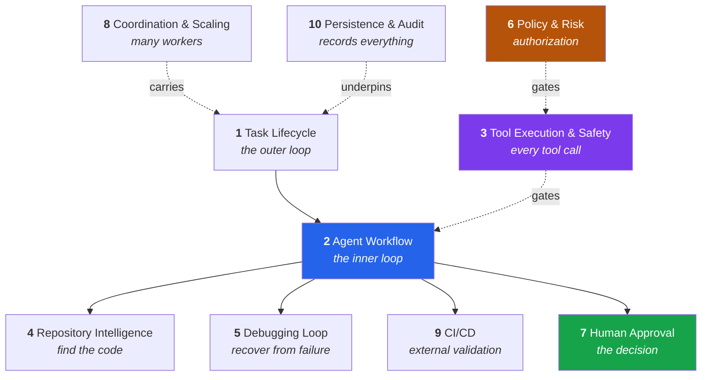

# Documentation

Start here.

| If you want to… | Read |
|---|---|
| **run it** | [Running the Application](Running-the-Application.md) |
| understand **why it is built this way** | [Requirements.md](Requirements.md) — the original specification |
| understand **how a specific part works** | the process guides below |
| see what was **built vs. deferred** | [../README.md](../README.md) |

---

## The one-paragraph version

An **engineering control plane around a coding-capable LLM**. The model reasons;
the platform decides what it is allowed to do, runs the checks whose answers
must be trustworthy, records everything, and stops the agent when it is no
longer making progress. It is not trying to be a better coding assistant — it is
the governance, isolation and audit layer around one.

---

## Process guides

Roughly in the order a change flows through the system.

| # | Process | What it covers |
|---|---|---|
| 1 | [Task Lifecycle](processes/01-task-lifecycle.md) | `POST /tasks` → queue → worker → settled. Idempotency, claiming, live events. |
| 2 | [Agent Workflow](processes/02-agent-workflow.md) | The 14-node LangGraph state machine and its deterministic routing. |
| 3 | [Tool Execution & Safety](processes/03-tool-execution-and-safety.md) | The three gates, workspace isolation, why there is no shell. |
| 4 | [Repository Intelligence](processes/04-repository-intelligence.md) | Finding the relevant code: lexical → symbols → dependencies → vectors. |
| 5 | [Debugging Loop](processes/05-debugging-loop.md) | Bounded recovery, failure fingerprinting, knowing when to stop. |
| 6 | [Policy & Risk](processes/06-policy-and-risk.md) | Deterministic authorization vs. advisory risk assessment. |
| 7 | [Human Approval](processes/07-human-approval.md) | Approval as a state; the line the agent does not cross. |
| 8 | [Coordination & Scaling](processes/08-coordination-and-scaling.md) | Queue, locks, leases, crash recovery, horizontal scaling. |
| 9 | [CI/CD Integration](processes/09-cicd-integration.md) | Provider abstraction, the CI fix loop, its separate budget. |
| 10 | [Persistence & Audit](processes/10-persistence-and-audit.md) | The eleven tables and the questions they answer. |

**Reading in a hurry?** 1 → 2 → 3. That is the spine: how work arrives, what the
agent does, and what stops it doing something else.

---

## How the processes fit together

Solid arrows are flow. Dashed arrows are constraint: 3, 6, 8 and 10 do not
happen *after* anything — they apply throughout.

---

## The five ideas worth taking away

1. **The API never runs an agent.** Persist, enqueue, return `202`. Everything
   else follows from that.
2. **Three gates before any tool call** — allowlist, policy, workspace boundary.
   A blocked write never happens; it is not undone afterwards.
3. **The platform runs the tests.** Pass/fail is a measurement, not a claim.
4. **Bounded autonomy.** Iteration cap, failure fingerprinting, scope guard.
   Hitting any of them escalates to a human, and never commits.
5. **Everything is auditable.** Eleven tables answer what was read, what was
   changed, what was refused, what it cost, and who approved it.

---

## Conventions in these documents

- Diagrams are **Mermaid**, rendered by GitHub — no image files to fall out of
  date.
- Every guide ends with a **where the code lives** table and the tests that
  cover it.
- References like *§22* point at numbered sections of
  [Requirements.md](Requirements.md).
- Where the implementation departs from the specification, the guide says so and
  gives the reason. The full list is in the root
  [README](../README.md#deliberate-departures-from-the-design-document).
