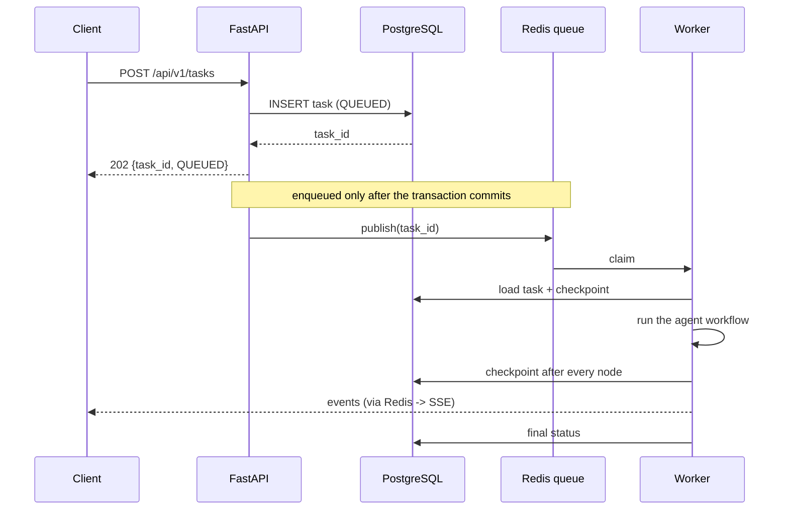
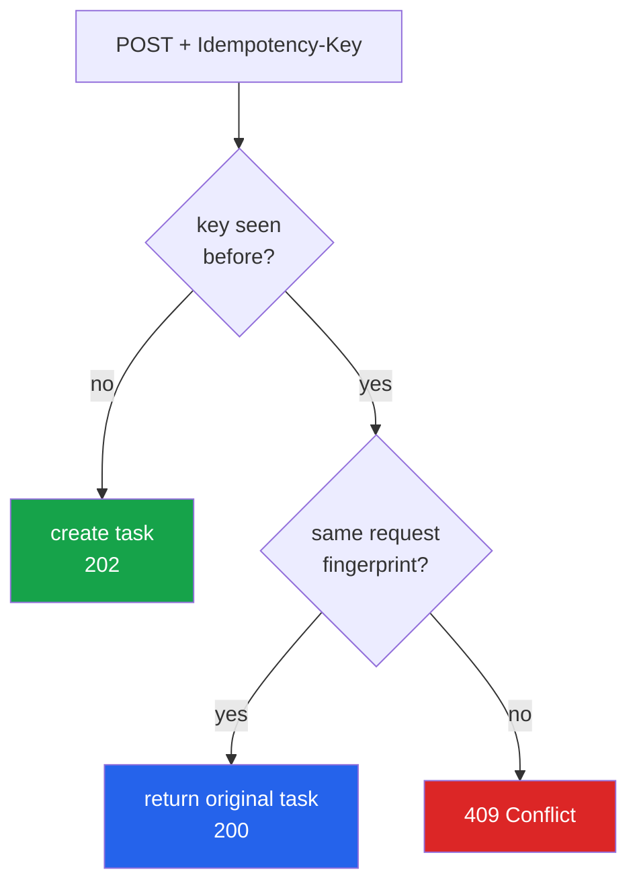
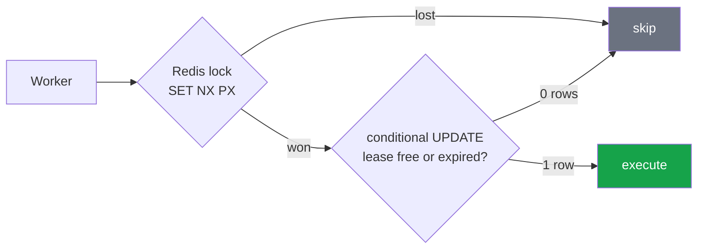
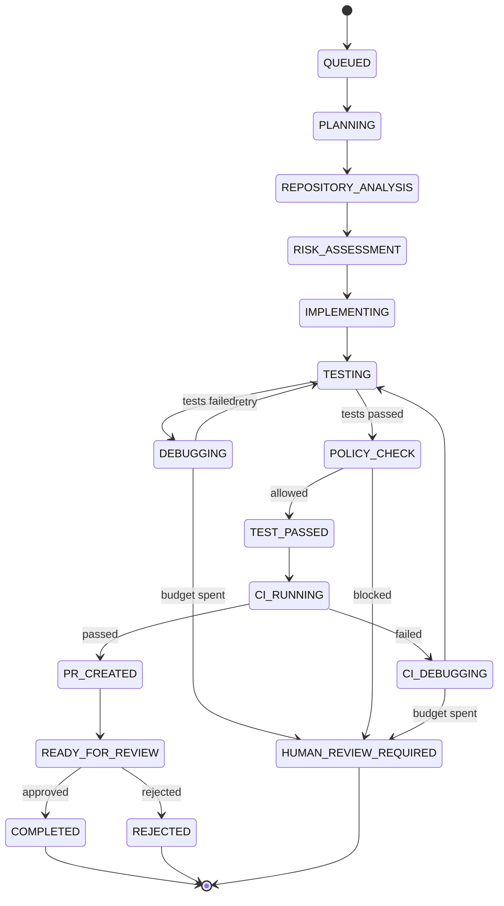
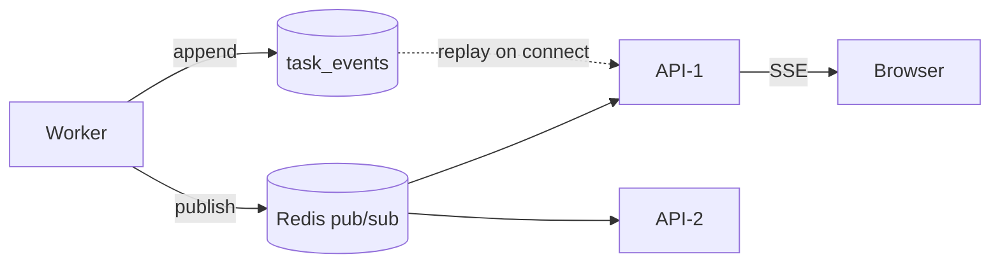

# Process 1 — Task Lifecycle

**What happens between `POST /api/v1/tasks` and a reviewer seeing a diff.**

This is the outer loop. The [agent workflow](02-agent-workflow.md) is the inner
loop that runs inside step 4.

---

## The one rule that shapes everything

> The API never executes an agent.

A request handler that ran a workflow would hold an HTTP connection open for
minutes, die with the process, and make the API impossible to scale separately
from the work. So the API does three cheap things — persist, enqueue, respond —
and a worker does the slow part.

---

## Step by step

### 1. Persist, then enqueue

The queue carries **task ids only**, never payloads. A worker always reloads
the task from PostgreSQL, so the database is the single source of truth and the
queue is just a doorbell.

Order matters. The id is published *after* the request transaction commits
(via a FastAPI background task), otherwise a fast worker could claim a task
that is not yet visible to it.

`apps/api/routes/tasks.py` → `apps/api/services.py`

### 2. Idempotency

Sending `Idempotency-Key: abc` twice returns the **same** task, not two.

The fingerprint is a hash of repository + issue. Reusing a key for a *different*
request is a client bug, so it is rejected rather than silently ignored.

### 3. Claiming — two locks, not one

A task must never run twice at once. Two independent guards:

The Redis lock is fast; the database lease is durable. If Redis loses its state,
the `UPDATE ... WHERE locked_by IS NULL OR lease_expires_at < now` still refuses
the second worker. Detail in
[08-coordination-and-scaling.md](08-coordination-and-scaling.md).

### 4. Execution

The worker builds a `WorkflowContext` (model, tools, workspaces, policy, SCM,
CI, event bus) and runs the LangGraph workflow. After **every node** it writes
the full state back to `tasks.state`, so another worker can resume.

`apps/worker/execution.py`

### 5. Settling

Two ways to finish:

- **`READY_FOR_REVIEW`** — it worked. A person decides.
- **`HUMAN_REVIEW_REQUIRED`** — it stopped itself. Also a person decides, but
  nothing was committed.

Both are *settled*: no worker will touch them again. That distinction matters
for the event stream, which closes on settled, not just on terminal.

---

## Live progress

Workers publish events to Redis; every API instance subscribes. A browser can
reconnect through a load balancer to a **different** API pod and lose nothing,
because the stream replays from PostgreSQL first and only then follows the live
channel.

Reconnect with `?after=<sequence>` to resume exactly where you left off.

---

## Where the code lives

| Step | File |
|---|---|
| endpoints | `apps/api/routes/tasks.py` |
| service layer | `apps/api/services.py` |
| task storage, leases | `persistence/repositories/tasks.py` |
| queue adapters | `infrastructure/queue/` |
| worker loop | `apps/worker/consumer.py` |
| one task's execution | `apps/worker/execution.py` |
| SSE | `apps/api/routes/events.py` |

**Tests:** `tests/integration/test_api.py`,
`tests/integration/test_worker_coordination.py`
