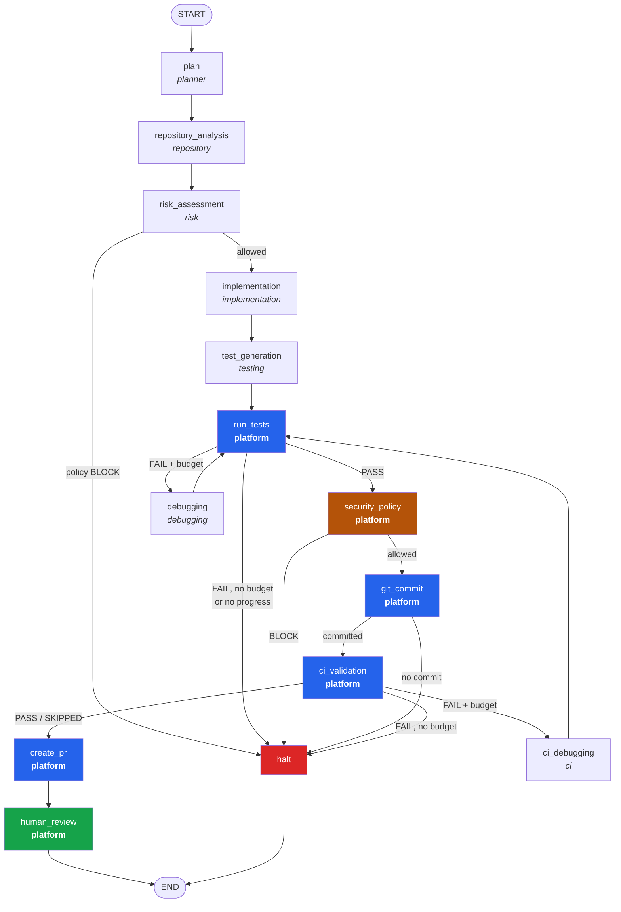
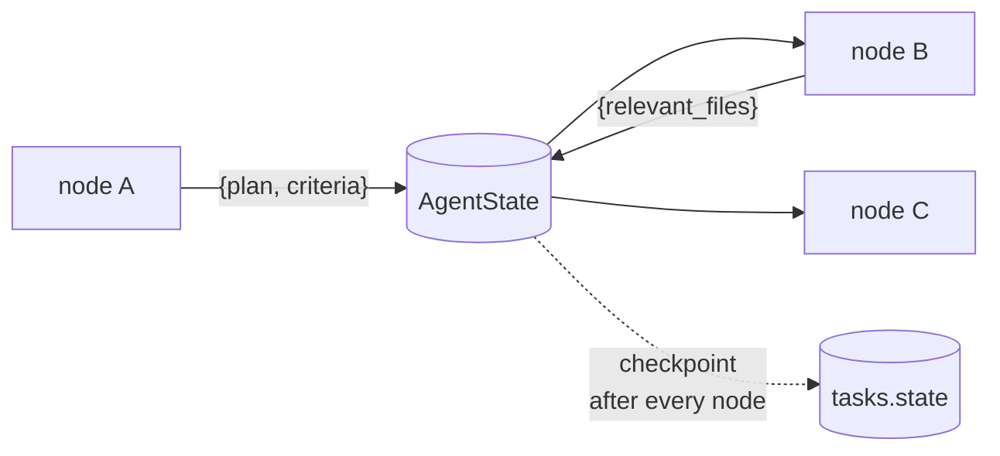
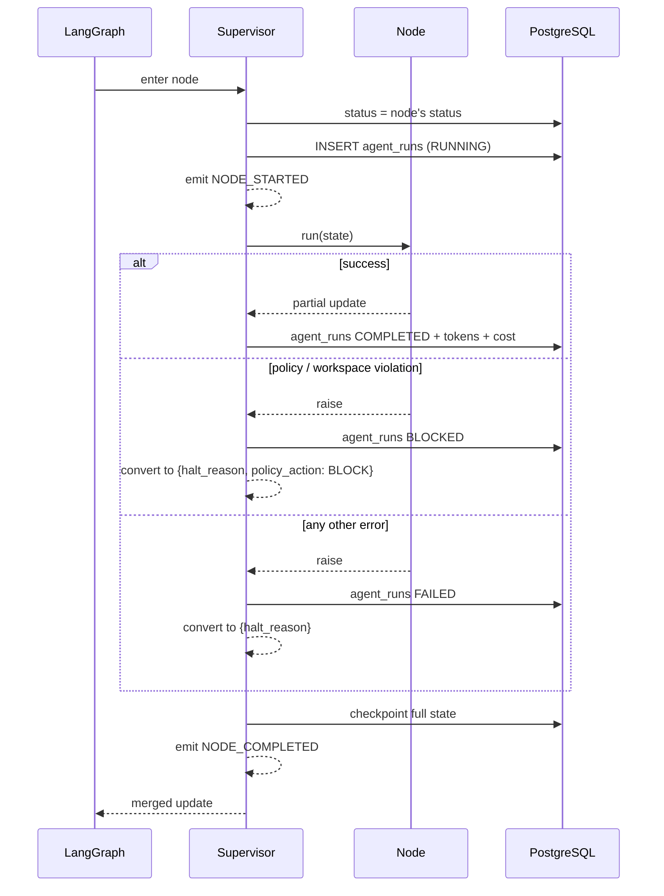

# Process 2 — The Agent Workflow

**The LangGraph state machine that turns an issue into a reviewable change.**

Fourteen nodes. Every branch between them is decided by a plain Python
function, never by a model.

---

## The graph

*Italic* = an LLM agent reasons here. **Bold** = the platform does it, so the
result cannot be hallucinated.

---

## Who does what

| Node | Agent | Tools it may use | Can it write? |
|---|---|---|---|
| `plan` | planner | **none** | no |
| `repository_analysis` | repository | search, read, symbols, deps | no |
| `risk_assessment` | risk | read, diff, list | no |
| `implementation` | implementation | read, search, symbols, **patch, create** | **yes** |
| `test_generation` | testing | read, search, **patch, create**, build | **yes** |
| `run_tests` | *platform* | — | no |
| `debugging` | debugging | read, search, symbols, **patch, create** | **yes** |
| `security_policy` | *platform* | — | no |
| `git_commit` | *platform* | — | no |
| `ci_validation` | *platform* | — | no |
| `ci_debugging` | ci | read, search, **patch** | **yes** |
| `create_pr` | *platform* | — | no |
| `human_review` | *platform* | — | no |

The planner having **zero** tools is deliberate: "the planner modified code" is
not a bug that can happen here, it is a state that cannot be represented.

---

## State is the contract

Nodes never call each other. Each returns a partial dict; LangGraph merges it
into `AgentState` ([graph/state.py](../../graph/state.py)).

Everything in the state is JSON-serialisable because the whole dictionary is
written to PostgreSQL after each node. That checkpoint is what lets a second
worker resume a task when the first one dies.

---

## The supervisor wraps every node

No node handles its own bookkeeping. `agents/supervisor.py` wraps all fourteen
with the same discipline:

**A node failure never crashes the worker.** It becomes a routing decision —
the graph continues to `halt`, which escalates to a human. That is the retry
classification of the design document made concrete: infrastructure blips are
retryable, policy violations are not, and everything else escalates.

---

## Routing is deterministic

Every conditional edge is a pure function in
[graph/routing.py](../../graph/routing.py) — no model involved, unit-tested
without a database:

| Function | Decides |
|---|---|
| `after_risk` | proceed, or halt if policy said BLOCK |
| `after_tests` | policy gate on pass; debug on fail *if* budget and progress allow |
| `after_policy` | commit, or halt on BLOCK |
| `after_commit` | CI, or halt if nothing was committed |
| `after_ci` | PR on pass; CI-debug on fail if budget allows |

`after_commit` exists because of a real bug: without it, a task that changed
nothing still ran CI, opened a pull request, and asked a human to review an
empty diff.

---

## Two deliberate departures from the design document

The specification contradicts itself in two places. Both were resolved toward
the safer reading, and both are recorded here rather than hidden:

1. **`security_policy` runs before `git_commit`.** §8's diagram puts CI before
   the commit; §26 requires a *pushed branch* for CI to run at all. Resolved as
   policy → commit → CI, so a blocked change never enters git history.
2. **The PR is created before approval.** §24 says approval precedes protected
   operations; §44/§45 show a PR present at `READY_FOR_REVIEW`. A pull request
   *is* the review surface, so it is created first — but **merging is never
   automated**, which is the protected operation §24 is actually about.

---

## Where the code lives

| Concern | File |
|---|---|
| graph assembly | `graph/workflow.py` |
| node bodies | `graph/nodes.py` |
| routing | `graph/routing.py` |
| state contract | `graph/state.py` |
| supervisor | `agents/supervisor.py` |
| agents | `agents/*.py` |
| prompts | `prompts/*.md` |

**Tests:** `tests/graph/test_workflow_end_to_end.py` (real worktree, real
`dotnet test`), `tests/unit/test_routing_and_fingerprint.py`
