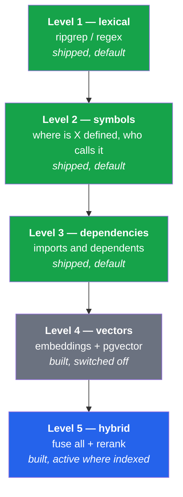
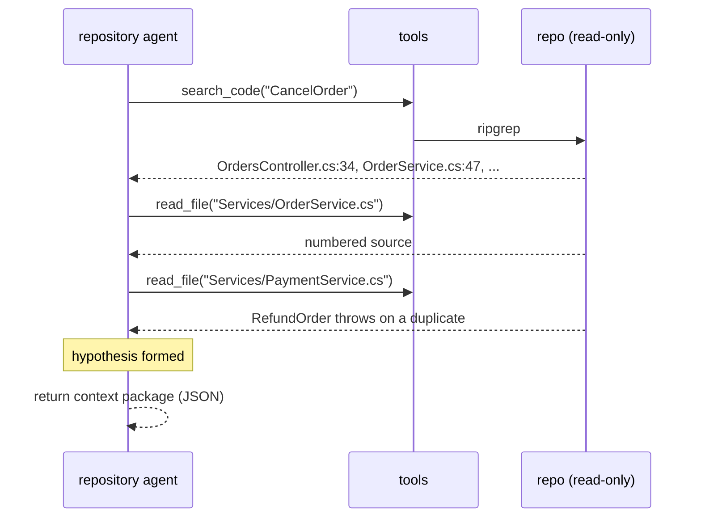
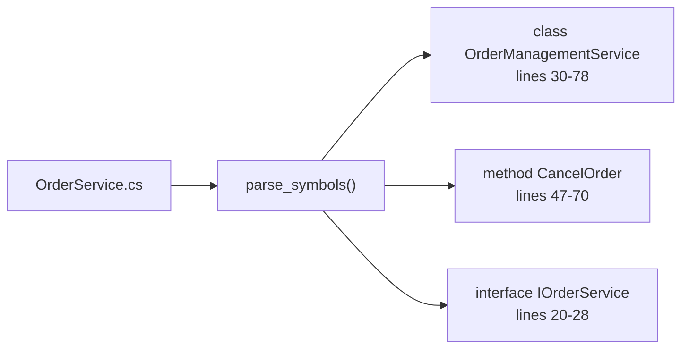
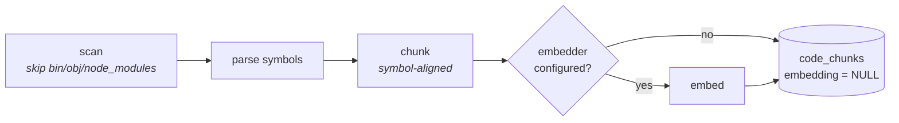
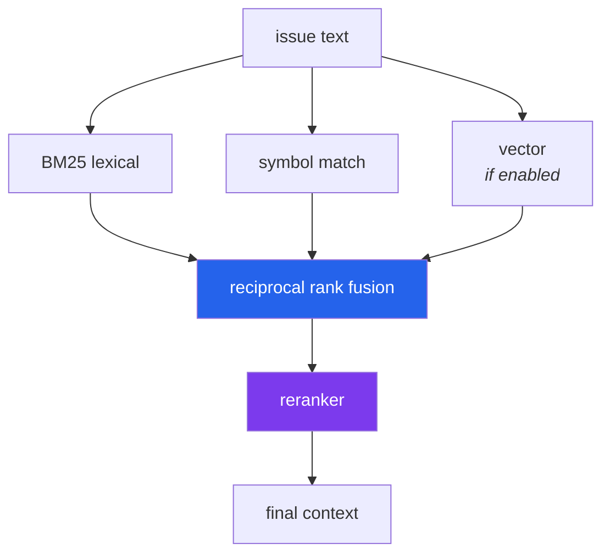

# Process 4 — Repository Intelligence

**How the agent answers: where is the code relevant to this issue?**

An LLM cannot read a large repository, and it should not try. This process
turns "orders fail to cancel" into three or four files worth reading.

---

## Retrieval is built in levels

The design document is explicit: **do not begin with vector search.** Levels 1–3
need no index, no embeddings and no model, and they solve most of the problem.



Level 4 is off because it needs an embedder. Turning it on is a migration plus
configuration — no code above `retrieval/search/` changes.

---

## What the agent actually does

The repository agent has six read-only tools and drives its own investigation:



Note the *directory it reads*: at this stage there is no worktree yet, so the
agent reads the developer's checkout — **read-only**. Nothing can write until
the implementation node creates the isolated worktree.

The output is a deliberately small package:

```json
{
  "relevant_files": ["...OrderService.cs", "...PaymentService.cs", "...Tests.cs"],
  "findings": ["CancelOrder refunds unconditionally, so a second call throws"],
  "entry_point": "src/OrderService/Services/OrderService.cs"
}
```

The prompt asks for 3–6 files, not everything that matched: the implementation
agent pays for every file named here.

---

## The tools

| Tool | Answers | Implementation |
|---|---|---|
| `search_code` | where does this text appear? | ripgrep, falling back to a bounded Python walk |
| `read_file` | what does this code do? | line-numbered, range-selectable |
| `list_directory` | how is this laid out? | build output filtered |
| `find_symbol` | where is `X` **defined**? | regex symbol index |
| `find_references` | who **calls** `X`? | word-boundary search minus definitions |
| `get_dependencies` | what does this file import, and who imports it? | usings / imports + type references |

`search_code` never hard-depends on ripgrep: if `rg` is absent it uses a pure
Python scan, so the platform has no invisible external requirement.

---

## Symbols without a language server

A regex symbol index, shared by the search tools *and* the RAG chunker, so
"what is a symbol" has exactly one definition
([retrieval/ingestion/parser.py](../../retrieval/ingestion/parser.py)).



Supported: C#, Python, TypeScript/JavaScript. It brace-matches to find where a
symbol ends and filters out control-flow keywords, so `if (...)` never appears
as a method. Approximate by design — a language server per language would be a
large dependency for a marginal gain at this scale.

---

## The RAG pipeline (levels 4–5)

```bash
python -m scripts.index_repository --path ./.sandbox/order-service --query "cancel order"
```



**Chunks are symbol-aligned, not fixed windows.** A chunk is a class or a
method, so a retrieved chunk is something a reviewer recognises and the citation
`OrderService.cs:47-70 (CancelOrder)` means something. Files with no extractable
symbols fall back to overlapping line windows.

### Hybrid retrieval and reranking



Fusion is **reciprocal rank fusion**, which combines rankings rather than
scores — so BM25 and cosine similarity can be merged without tuning weights per
corpus.

The reranker then applies what actually matters when ranking code for a bug fix:

| Signal | Weight |
|---|---|
| symbol name matches the query | **+2.0** |
| path contains a query term | +1.0 |
| service / controller / handler / repository | +0.5 |
| method or function | +0.3 |
| looks like a test file | **−0.4** |
| chunk under 3 lines | −0.3 |

That test-file penalty is load-bearing. BM25 favours short documents, so a
four-line test method routinely outranks the service it exercises. A unit test
pins both behaviours: lexical *recalls* both, the reranker *orders* production
code first.

---

## Where the code lives

| Concern | File |
|---|---|
| search tools | `tools/repository/` |
| symbol parsing | `retrieval/ingestion/parser.py` |
| scan / chunk / index | `retrieval/ingestion/` |
| BM25 | `retrieval/search/lexical.py` |
| vectors | `retrieval/search/vector.py` |
| fusion | `retrieval/search/hybrid.py` |
| reranking | `retrieval/search/reranker.py` |
| enabling pgvector | `persistence/migrations/0002_pgvector.sql` |

**Tests:** `tests/unit/test_retrieval.py`
