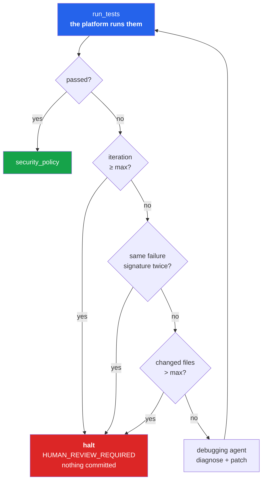
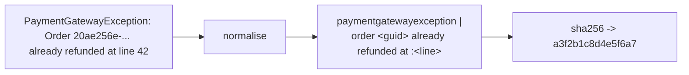
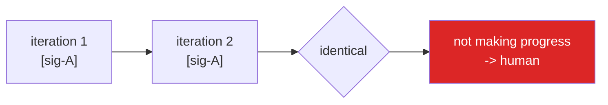
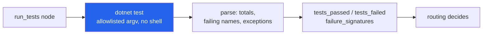
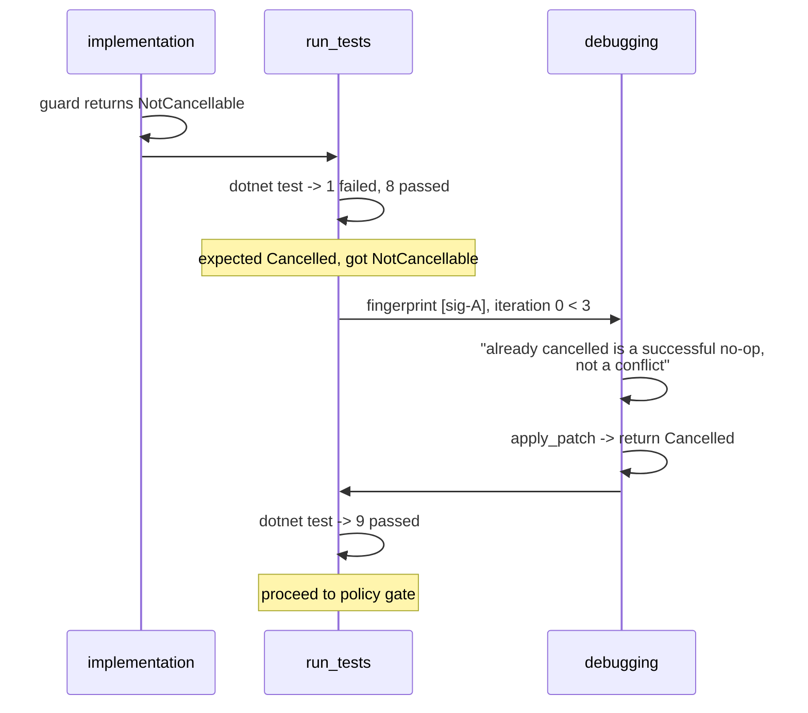

# Process 5 — The Bounded Debugging Loop

**The most important agentic behaviour in the platform — and the one most in
need of a leash.**

An agent that can retry is useful. An agent that can retry *forever* burns money
and eventually damages the codebase. This process is about knowing when to stop.

---

## The loop



Three independent brakes. Any one of them ends the loop.

---

## Brake 1 — a hard iteration cap

`MAX_AGENT_ITERATIONS` (default **3**). Simple, and the only brake that is
guaranteed to fire.

## Brake 2 — failure fingerprinting

The interesting one. An agent can burn its whole budget producing three
variations of the same broken idea. Fingerprinting notices.

Each failure is normalised, then hashed:



Normalisation strips everything that varies between identical runs:

| Removed | Why |
|---|---|
| GUIDs | a new order id each run |
| timestamps | wall clock |
| durations (`12ms`) | timing noise |
| line numbers | shift as the agent edits |
| file paths | differ per worktree |
| hex addresses | not meaningful |

Order matters here — timestamps are consumed *before* the line-number rule,
which would otherwise chew through `10:00:00`. That was a real bug caught by a
unit test.



Two identical rounds means stop — which usually fires *before* the iteration
cap, saving a wasted attempt. An empty failure set is explicitly not evidence of
being stuck.

## Brake 3 — the scope guard

If `modified_files` exceeds `MAX_FILES_PER_TASK`, stop. A change that keeps
growing is a change that is no longer understood.

---

## What the debugging agent sees

It is shown every previous attempt, so it cannot silently repeat itself:

```
Debugging iteration 2 of 3.

Current test failures:
  OrderCancellationIdempotencyTests.CancelOrder_AlreadyCancelled_ReturnsSuccess
  Assert.Equal() Failure: Expected Cancelled, Actual NotCancellable

Previous attempts:
  - iteration 0: CancelOrder_AlreadyCancelled_ReturnsSuccess: Assert.Equal...
  - iteration 1 analysis: Added a guard returning NotCancellable for an
    already-cancelled order.
```

The prompt asks it to form **one hypothesis before touching a file**, and gives
it explicit permission to fix the *test* when the production behaviour is right
and the expectation is wrong — with the reason stated.

Two things it may never do: delete or weaken a test to make the suite green, and
widen the change to unrelated files.

---

## Why the platform runs the tests

`run_tests` is a platform node, not an agent action. The result comes from a
process exit code and parsed output:



If an agent reported its own results, "the tests pass" would be a claim. Here it
is a measurement. The parser is tested against **verbatim** `dotnet test` output
captured from the sample repository, not against an idea of the format.

Edge cases it handles: a build error becomes one synthetic failure (nothing ran,
but the run failed), and a timeout is never `ok` regardless of exit code.

---

## A real run

From the end-to-end test, which exercises exactly this:



The companion test scripts a debugger that *never* fixes anything and asserts
the opposite outcome: `HUMAN_REVIEW_REQUIRED`, no commit, and a
`NO_PROGRESS_DETECTED` event.

---

## CI has its own budget

The same shape, a separate counter (`MAX_CI_ITERATIONS`, default 2), because CI
failures have different causes — see
[09-cicd-integration.md](09-cicd-integration.md).

---

## Where the code lives

| Concern | File |
|---|---|
| the brakes | `graph/routing.py` (`after_tests`) |
| fingerprinting | `graph/fingerprint.py` |
| test execution and parsing | `tools/testing/test.py` |
| the agent | `agents/debugging_agent.py` |
| its prompt | `prompts/debugging.md` |
| loop nodes | `graph/nodes.py` |

**Tests:** `tests/unit/test_routing_and_fingerprint.py`,
`tests/unit/test_test_output_parser.py`,
`tests/graph/test_workflow_end_to_end.py`
