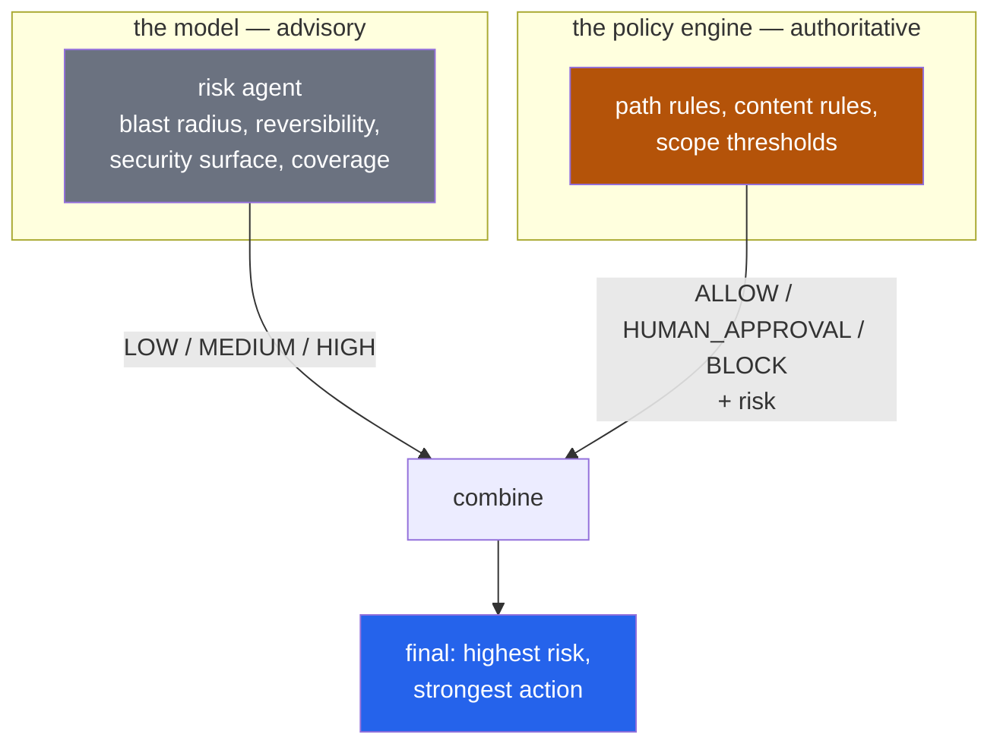
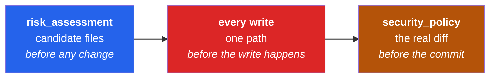
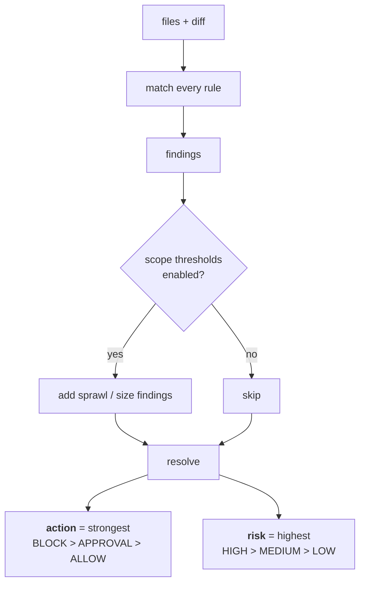
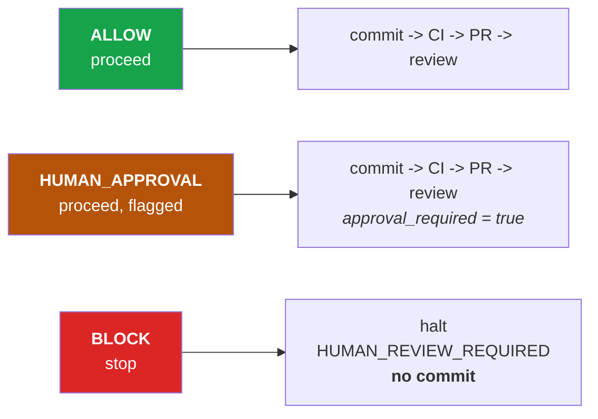

# Process 6 — Policy and Risk

**What the agent is not allowed to do, and how confident we are about the rest.**

The governing principle:

> **Prompt = guidance. Policy = authorization. Code = enforcement.**

A prompt saying "don't touch secrets" is a suggestion to a probabilistic system.
The policy engine is a deterministic function that runs whether the model
cooperates or not.

---

## Two assessments, different jobs



The model can only ever **raise** the risk level, never lower it. The prompt
says so plainly: *"Be honest rather than reassuring."*

---

## When policy runs

Three times, for three different reasons:



The middle one is the strong guarantee: a blocked file is **never written**, not
written-then-reverted.

### One subtlety worth knowing

Scope thresholds (file count, line count) are **off** during risk assessment and
per-write checks, and **on** only at `security_policy`. At the earlier stages
`files` means *candidate files to read*, not change scope — counting those made
every task that needed to look at five files report MEDIUM before a line was
written. That was a real bug.

```python
engine.evaluate(files=candidates, apply_scope_thresholds=False)  # risk stage
engine.evaluate(files=changed, diff=diff, lines_changed=n)       # commit gate
```

---

## The rules

[policies/rules.yaml](../../policies/rules.yaml) — editable without touching
Python. Three ways to match:

| Key | Matches against |
|---|---|
| `patterns` | glob on the file's **basename** (`.env`, `*.pem`) |
| `paths` | substring of the **full path** (`Authentication/`) |
| `content` | regex against the **added lines** of the diff |

### Shipped rules

| Rule | Action | Catches |
|---|---|---|
| `block-secrets` | **BLOCK** | `.env`, `*.pem`, `*.pfx`, `*.key`, `*credentials*`, `*secrets*` |
| `block-committed-secret-values` | **BLOCK** | private keys and hardcoded passwords *inside* an ordinary file |
| `production-infrastructure` | **BLOCK** | `infra/prod/`, `deploy/production/` |
| `sensitive-auth` | APPROVAL | `Authentication/`, `Authorization/`, `Security/`, `Identity/` |
| `ci-workflow-changes` | APPROVAL | `.github/workflows/`, `azure-pipelines` |
| `database-migrations` | APPROVAL | `Migrations/` |
| `dependency-manifest` | APPROVAL | `*.csproj`, `package.json`, `pyproject.toml` |

Plus thresholds: `max_files_changed: 12`, `max_lines_changed: 800`,
`medium_risk_files: 4`.

`block-committed-secret-values` is the one that catches what filename rules
miss — a key pasted into `Config.cs` rather than into a file called `.env`.

---

## How a decision is reached



Every finding carries its reason, and the reasons travel all the way to the pull
request body and the reviewer's screen. A reviewer never sees a bare "BLOCKED".

---

## What each action does



Note that **every** change reaches a human in this POC — `approval_required` is
set whenever files changed at all. The distinction is whether the agent got far
enough to produce something worth reviewing.

---

## Inspecting and changing the rules

The active rules are readable at runtime — a reviewer can see what they are
trusting:

```bash
curl http://localhost:8000/api/v1/policies
```

To add one, edit `rules.yaml` and add a test. The engine is a pure function, so
tests need no database, no model and no network:

```python
def test_secret_files_are_blocked(engine):
    assert engine.evaluate(files=["src/.env"]).blocked
```

`tests/unit/test_policy_engine.py` covers each shipped rule, threshold, the
strongest-action-wins rule, and the thresholds-off case.

---

## What is deliberately not here

Per the POC boundaries: no production database access, no production deploys,
no production secrets, no unrestricted shell, no automatic merge, no unbounded
loops. Those are not "not yet implemented" — they are out of scope by design.

---

## Where the code lives

| Concern | File |
|---|---|
| rules | `policies/rules.yaml` |
| engine | `policies/evaluator.py` |
| pre-write gate | `agents/base.py` (`_execute_tool`) |
| commit gate | `graph/nodes.py` (`security_policy`) |
| risk agent | `agents/risk_agent.py`, `prompts/risk.md` |
| exposure | `apps/api/routes/repositories.py` |

**Tests:** `tests/unit/test_policy_engine.py`,
`tests/integration/test_tool_gating.py`
