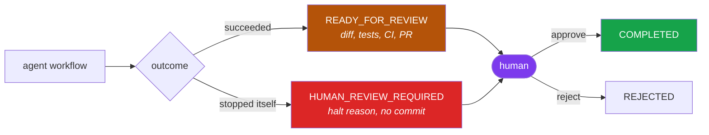
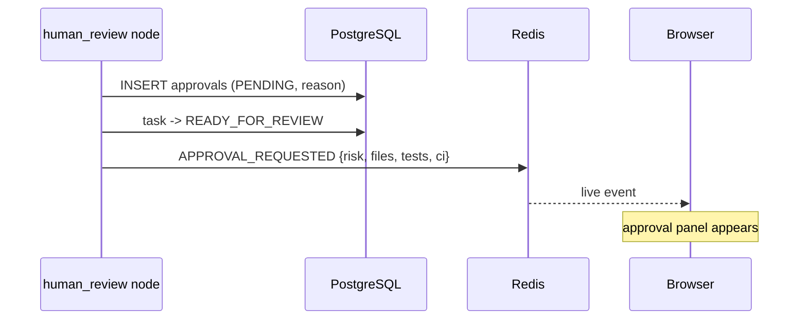
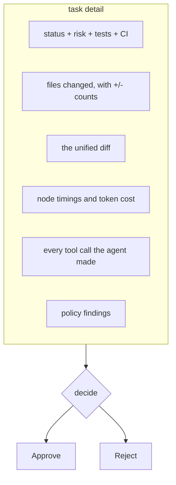
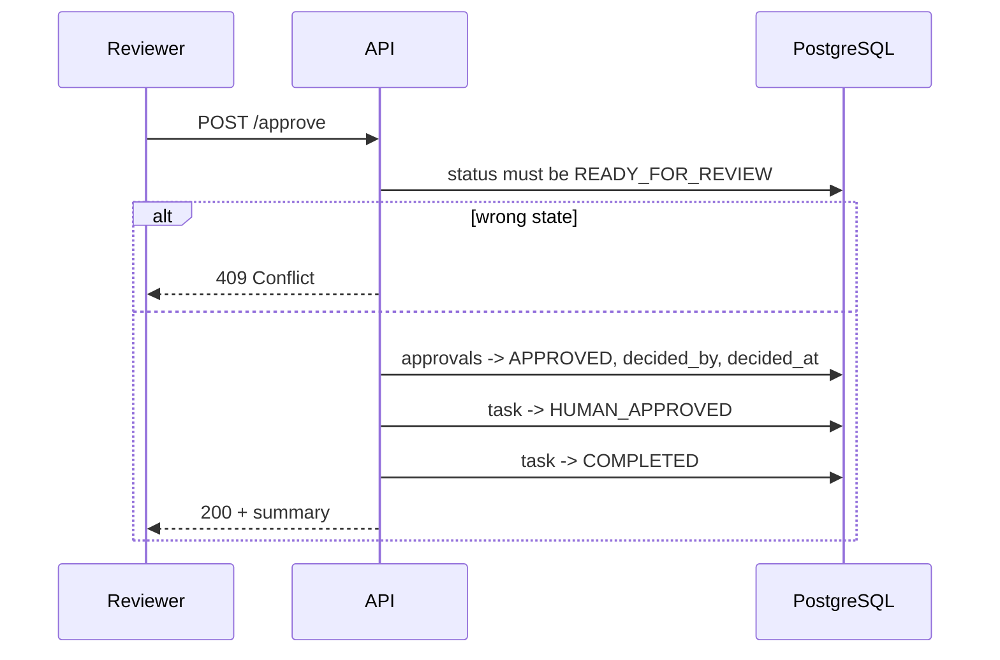
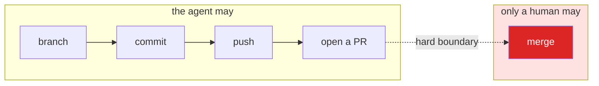

# Process 7 — Human Approval

**Approval is a state in the machine, not a notification at the end.**

The agent's job finishes at "here is a reviewable change". A person decides
whether it lands.

---

## Where approval sits



Both are **settled**: no worker will touch them again, and both need a person.
The difference is what is waiting:

- **`READY_FOR_REVIEW`** — tests pass, a commit exists, a PR is open. Review a
  real change.
- **`HUMAN_REVIEW_REQUIRED`** — the agent hit a limit or a policy block.
  Nothing was committed. Read *why it stopped*.

---

## The request

The `human_review` node records the request durably, then emits an event:



The reason comes from the policy findings, so the reviewer is told *why* this
needs them — "sensitive-auth: Authentication and security code always needs a
human" — not merely that it does.

---

## What the reviewer sees



Everything on that screen comes from the audit tables, not from the model's
account of itself — see
[10-persistence-and-audit.md](10-persistence-and-audit.md). "Which files did it
actually change" is answered by `file_changes` rows written when the write
succeeded.

---

## Deciding

```bash
curl -X POST http://localhost:8000/api/v1/tasks/TASK-123/approve \
  -H "Content-Type: application/json" \
  -d '{"decided_by": "nasim", "reason": "idempotent fix, tests cover it"}'
```



The state check is the point: a `QUEUED` task cannot be approved, so a stray
call cannot wave through work that has not happened yet.

`POST /reject` records `REJECTED` with the reason. `POST /cancel` stops a task
that is still running.

The review queue is `GET /api/v1/approvals` — everything waiting on a person,
newest first.

---

## The line the agent does not cross

**The agent never merges.** Approval records a decision and completes the task.
Merging a pull request stays a human action in a human tool.



This is why the design document's two statements about approval ordering can
both be honoured. §24 says approval must precede protected operations; §44/§45
show a PR present at `READY_FOR_REVIEW`. A pull request is the *review surface*,
so it is created first — and the protected operation §24 is really about, the
merge, is never automated at all.

---

## Where the code lives

| Concern | File |
|---|---|
| requesting approval | `graph/nodes.py` (`human_review`) |
| decisions | `apps/api/services.py` |
| endpoints | `apps/api/routes/tasks.py` |
| review queue | `apps/api/routes/approvals.py` |
| records | `persistence/repositories/audit.py` |
| UI | `apps/web/app/tasks/[taskId]/page.tsx` |

**Tests:** `tests/integration/test_api.py` (approve, reject, cancel, wrong-state
409), `tests/graph/test_workflow_end_to_end.py` (a PENDING approval exists at
`READY_FOR_REVIEW`)
