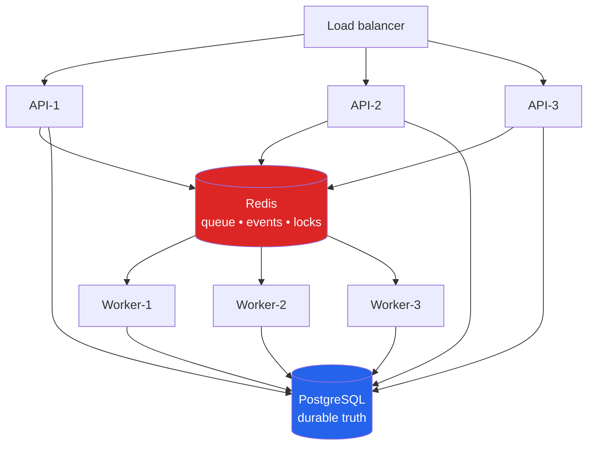
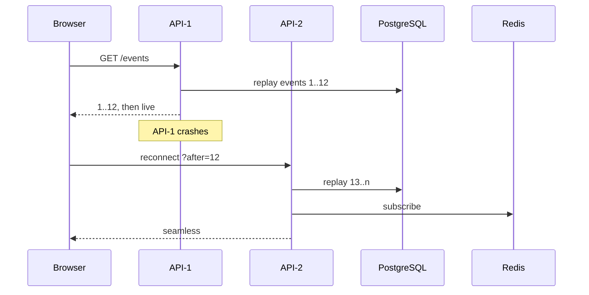
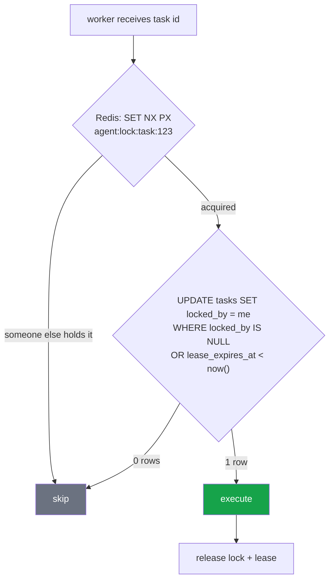
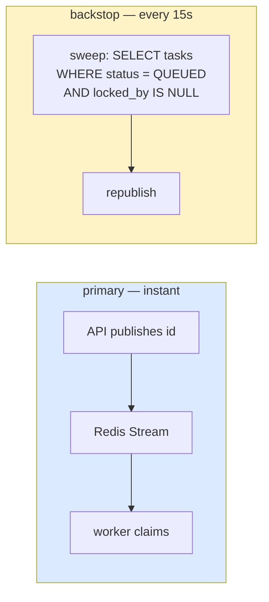
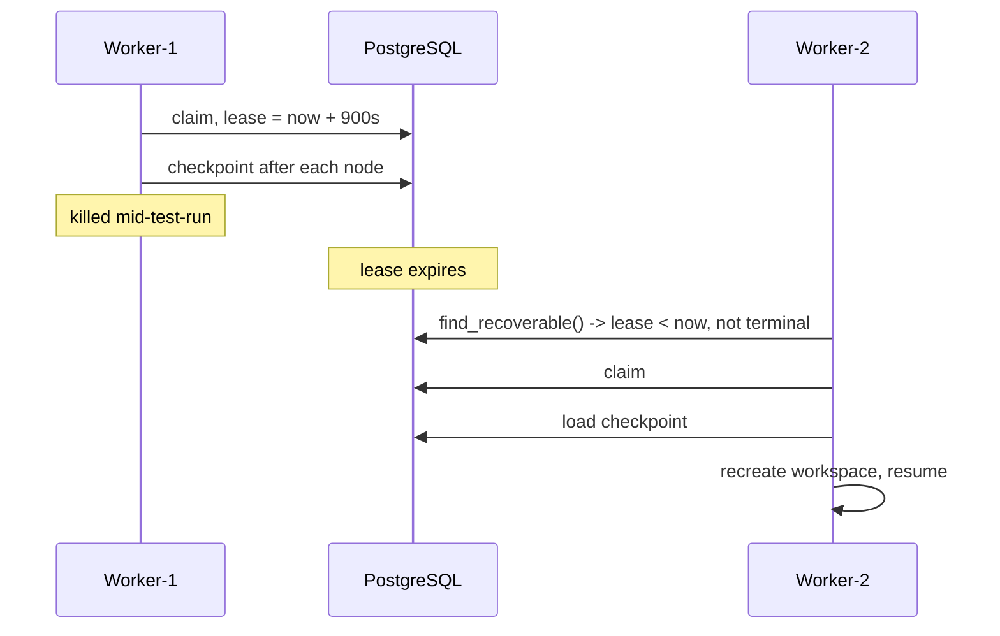
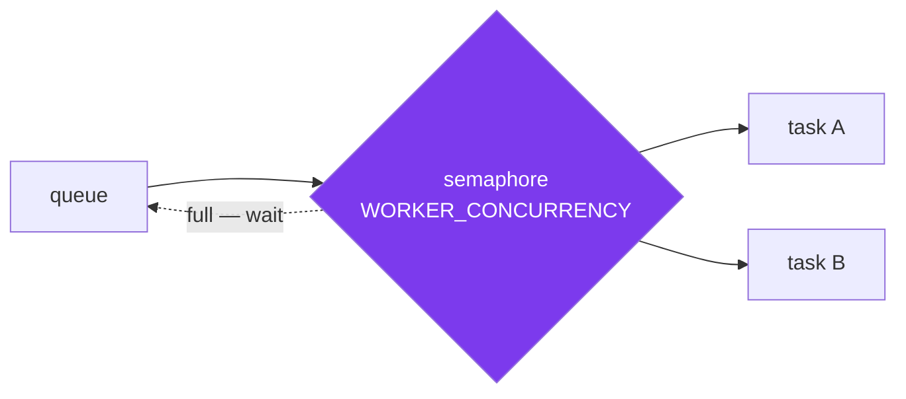

# Process 8 — Coordination, Scaling and Recovery

**How one worker becomes twenty, and what happens when one dies mid-task.**

---

## Why the split exists

API traffic and agent workload have nothing in common. A hundred people polling
a task list is cheap; one agent run is minutes of CPU and a `dotnet build`. Tie
them together and you scale the wrong thing.



**Scale the API on HTTP traffic. Scale workers on queue depth.** Independently.

---

## The division of labour

| | PostgreSQL | Redis |
|---|---|---|
| task record | **yes** | cache at most |
| workflow checkpoint | **yes** | no |
| audit history | **yes** | never |
| task queue | no | **yes** |
| distributed lock | no | **yes** |
| live events | no | **yes** |

The rule that keeps this honest: **Redis is never the only copy of anything that
matters.** Flush it and you lose in-flight coordination, not history.

---

## Stateless API instances

No task registry, no connection registry, nothing in module scope a second pod
would not have. That is what lets a browser reconnect through the load balancer
to a *different* pod mid-task and lose nothing:



---

## One task, one worker

Two guards, deliberately redundant:



Redis is fast but can lose state; the conditional `UPDATE` is atomic in the
database and survives anything Redis does. Neither alone is sufficient: Redis
alone loses the guarantee on a flush, the database alone would need polling.

Locks are owner-checked — releasing a lock you do not hold is a no-op, enforced
by a Lua script so it is atomic.

---

## Two ways work reaches a worker



The sweep reconciles the queue against the durable record. It exists because the
gap between "task row committed" and "queue message published" is a real failure
mode — and because with `REDIS_URL=memory://` the queue is in-process, so the
sweep is how a separate worker finds work at all.

Republishing a task that is already running is harmless: the lock and lease make
the duplicate a no-op.

---

## When a worker dies



Nothing is lost that matters. The workspace was disposable; the state was
checkpointed after every node. `READY_FOR_REVIEW` tasks are excluded from
recovery — they are waiting on a person, not on a worker.

Redis Streams add a second layer: an unacked message stays in the consumer
group's pending list and `XAUTOCLAIM` hands it to a healthy worker.

---

## Concurrency inside one worker



`WORKER_CONCURRENCY × replicas` is your total concurrency. 2 × 3 = 6.

Tasks are I/O-bound (model calls, builds), so async concurrency works well —
but each task also spawns `dotnet build`, so raise this against CPU, not
intuition.

---

## Scaling in practice

```bash
make worker                     # more terminals = more workers
docker compose up --scale worker=3
kubectl scale deployment/agent-worker --replicas=10
```

No code changes at any step.

Two Kubernetes details that matter for long tasks:

- `terminationGracePeriodSeconds: 900` — let an in-flight task reach a
  checkpoint before the pod dies.
- Scale-down stabilisation of 600s — agent tasks are long; eager scale-down
  kills work in progress.

Workers have **no Service and no ingress**. Nothing calls them; they pull. A
NetworkPolicy enforces it.

---

## Choosing a backend

| | `memory://` | `redis://` |
|---|---|---|
| processes | one | many |
| survives restart | no | yes |
| use for | tests, laptop demo | anything real |

`memory://` implements the same interfaces, so it is adapter selection rather
than a second architecture — but it gives up horizontal scaling, and the README
says so. With it, run `make run-local` rather than separate API and worker.

---

## Where the code lives

| Concern | File |
|---|---|
| adapter selection | `infrastructure/__init__.py` |
| queue | `infrastructure/queue/` |
| locks | `infrastructure/locks/` |
| events | `infrastructure/events/` |
| leases, sweeps | `persistence/repositories/tasks.py` |
| worker loop | `apps/worker/consumer.py` |
| deployment | `infrastructure/kubernetes/` |

**Tests:** `tests/integration/test_worker_coordination.py` — exclusive claim,
expired-lease reclaim, terminal tasks unclaimable, concurrency cap, nack
requeue
