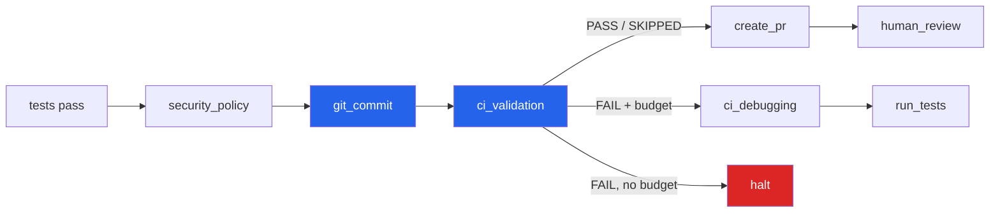
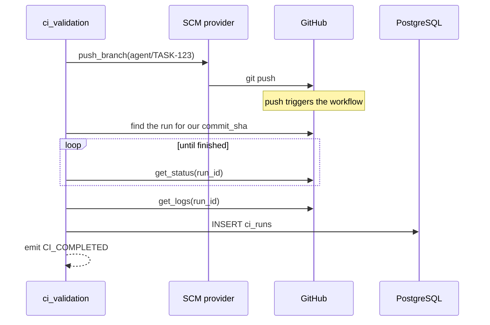
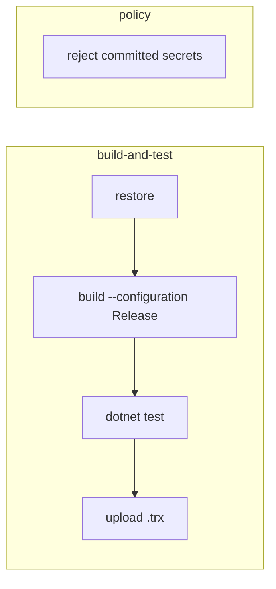
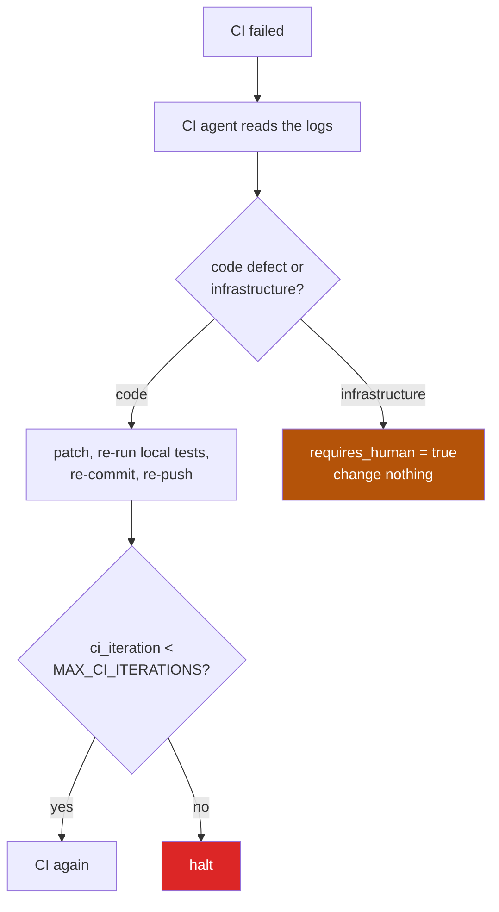

# Process 9 — CI/CD Integration

**External validation: proving the change works somewhere that is not the
agent's laptop.**

Local tests pass in the agent's worktree, with its file paths, its case
sensitivity and its installed SDK. CI is the independent check.

---

## Where CI sits



CI runs **after** the commit, because a pipeline needs a pushed branch to run
against. That is why the policy gate moved ahead of the commit — see
[02-agent-workflow.md](02-agent-workflow.md).

---

## The provider abstraction

Nothing above `providers/ci/` knows which CI system is in use:

```python
class CIPipelineProvider:
    async def trigger(self, branch, *, commit_sha=None) -> CIRunResult: ...
    async def get_status(self, run_id) -> CIRunResult: ...
    async def get_logs(self, run_id) -> str: ...
```

| Provider | `CI_PROVIDER` | Behaviour |
|---|---|---|
| `NoopCIProvider` | `none` *(default)* | reports **SKIPPED** — honest about there being no pipeline |
| `GitHubActionsProvider` | `github_actions` | finds the run the push started, polls it |

`SKIPPED` rather than `PASSED` is deliberate. A no-op provider that reported
success would quietly turn "no pipeline configured" into a green tick.

Source control is abstracted the same way (`SCM_PROVIDER`: `local`, `github`,
`azure_devops`), so the same node drives any of them.

---

## A real CI cycle



Triggering is **push-driven**: the workflow reacts to `agent/**` branches, so
`trigger()` finds the run GitHub already started for our commit rather than
dispatching a second one. It retries briefly with backoff, because the run takes
a moment to appear in the API.

---

## The sample pipeline

[sample-repo/order-service/.github/workflows/ci.yml](../../sample-repo/order-service/.github/workflows/ci.yml)
runs on `main` and `agent/**`:



The `policy` job re-checks for committed secrets in the pipeline. The agent's
own policy engine already blocks them, but a second enforcement point that the
agent cannot influence is worth having.

---

## When CI fails

CI failures usually have different causes than local ones — the environment
differs, not the logic:



The prompt lists the usual suspects in order of likelihood: a restore step that
only runs in CI, case-sensitive paths (CI is Linux, the developer often is not),
an uncommitted file, a test that depends on local state or timing, an SDK
mismatch — and only then a genuine defect.

**`requires_human` is a first-class answer.** Missing credentials or an
unavailable service is not something an agent should paper over; saying so and
stopping is the correct outcome, not a failure.

The CI budget is separate from the debugging budget (`MAX_CI_ITERATIONS`,
default 2), because burning local debugging attempts on environment problems
would be wrong.

The fix loop routes back through `run_tests`, so a CI fix is re-verified
locally before it is pushed again.

---

## Enabling real CI

```ini
SCM_PROVIDER=github
CI_PROVIDER=github_actions
GITHUB_TOKEN=ghp_...
GITHUB_REPOSITORY=owner/name
```

The token needs `repo` scope. It is used for pushes and API calls, and is
deliberately never logged — a failed push reports its exit code, not the command
line, because the remote URL embeds the token.

Every run is recorded in `ci_runs`: provider, external id, branch, status, URL,
logs (truncated), and which iteration it belonged to.

---

## Where the code lives

| Concern | File |
|---|---|
| interface | `providers/ci/base.py` |
| GitHub Actions | `providers/ci/github_actions.py` |
| no-op | `providers/ci/noop.py` |
| SCM interface | `providers/scm/base.py` |
| GitHub / Azure / local SCM | `providers/scm/` |
| selection | `providers/factory.py` |
| nodes | `graph/nodes.py` (`ci_validation`, `ci_debugging`) |
| agent | `agents/ci_agent.py`, `prompts/ci.md` |
| sample pipeline | `sample-repo/order-service/.github/workflows/ci.yml` |
