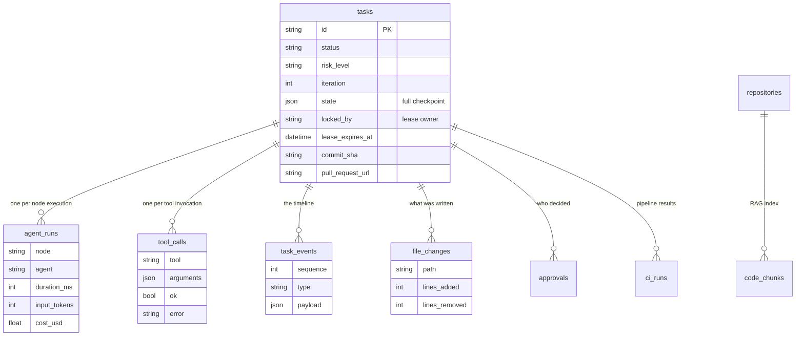
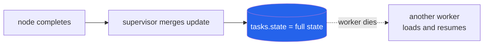
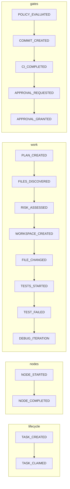
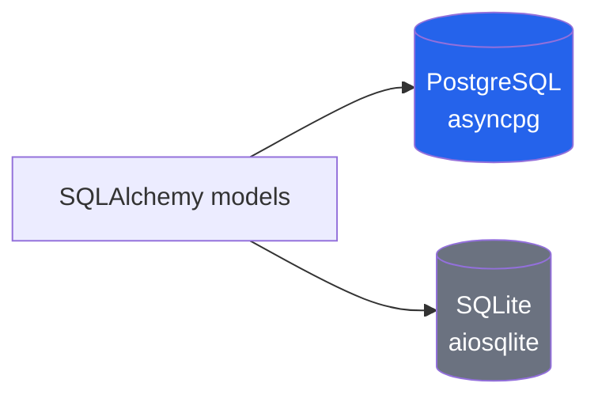
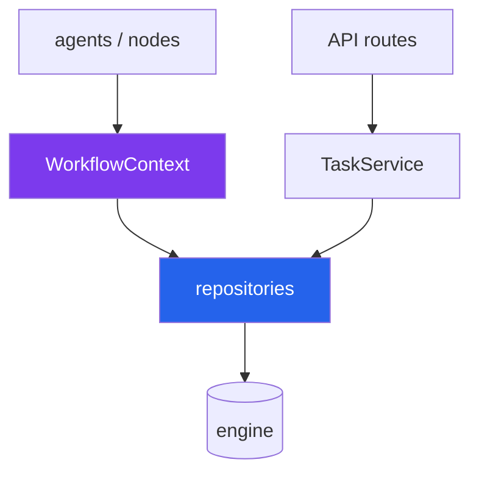

# Process 10 — Persistence and Audit

**Answering "what did the agent actually do?" with a query, not a guess.**

When an autonomous system changes code, the interesting questions are asked
afterwards. Every one of them is answerable from the database.

---

## The eleven tables



Plus `idempotency_keys` (request replay) and `evaluation_results` (benchmark
history).

---

## What each table answers

| Question | Table |
|---|---|
| Who started it, and what was asked? | `tasks` |
| What did the agent read? | `tool_calls` (read/search calls) |
| What did it change? | `file_changes` |
| Which tools did it call, and did any fail? | `tool_calls` |
| How many debugging iterations? | `tasks.iteration`, `agent_runs` |
| Which tests failed? | `tasks.state`, `task_events` |
| What did CI say? | `ci_runs` |
| Who approved it, when, and why? | `approvals` |
| What did it cost? | `agent_runs.cost_usd`, tokens |
| Where was time spent? | `agent_runs.duration_ms` |

The important property: **`file_changes` rows are written when a write
succeeds**, not when the model claims one. The implementation node explicitly
trusts what the tools actually wrote over what the model reported:

```python
changed = touched or declared   # tool evidence wins
```

---

## The checkpoint

`tasks.state` holds the entire `AgentState` after every node:



Everything in the state is JSON-serialisable precisely so this works. It is why
a killed worker costs a node, not a task.

---

## The event timeline

Append-only, monotonically sequenced per task, 29 event types:



Every event is written to PostgreSQL **and** published to Redis. The durable
copy is the audit record; the Redis copy is the live UI. The `sequence` column
is what makes `?after=N` reconnection lossless.

---

## Two engines, one set of models



PostgreSQL is the target; SQLite exists so the POC starts on a laptop with no
Docker. Two portability decisions make one set of models work on both:

- **`UtcDateTime`** — SQLite silently drops timezone offsets, which turned every
  `lease_expires_at < now` comparison into a `TypeError`. Normalising in one
  column type fixed the whole class of bug rather than patching call sites.
- **`JsonList` / `JsonDict` / `Embedding`** — JSON in a `TEXT` column, identical
  on both engines.

---

## Where embeddings live

`code_chunks.embedding` is JSON text today. Levels 1–3 of retrieval need no
vectors at all, so the platform ships with the column null.

Turning on real vector search is a migration plus configuration:

```sql
ALTER TABLE code_chunks
    ALTER COLUMN embedding TYPE vector(1536) USING embedding::vector;
CREATE INDEX ... USING hnsw (embedding vector_cosine_ops);
```

[persistence/migrations/0002_pgvector.sql](../../persistence/migrations/0002_pgvector.sql)
includes the SQL that replaces the Python similarity loop. Nothing above
`retrieval/search/` changes.

---

## Layering

Agents never touch the database. That is what makes them testable.



`WorkflowContext` is the dependency-injection seam: a node receives its model,
tools, policy engine and providers rather than constructing them, so any node
can be tested with fakes.

Session boundaries are per-unit-of-work (`session_scope`): commit on success,
roll back on exception, always close.

---

## Reading the trail

```sql
-- everything the agent did, in order
SELECT sequence, type, payload FROM task_events
WHERE task_id = 'TASK-123' ORDER BY sequence;

-- what it changed
SELECT path, lines_added, lines_removed FROM file_changes WHERE task_id = 'TASK-123';

-- anything it tried that was refused
SELECT tool, arguments, error FROM tool_calls WHERE task_id = 'TASK-123' AND NOT ok;

-- what it cost and where the time went
SELECT node, duration_ms, input_tokens, output_tokens, cost_usd
FROM agent_runs WHERE task_id = 'TASK-123' ORDER BY created_at;
```

Or over HTTP: `GET /api/v1/tasks/{id}` returns all of it in one response.

---

## Schema management

The POC bootstraps with `create_all`. The reviewable equivalent lives in
`persistence/migrations/`:

| File | Purpose |
|---|---|
| `0001_initial.sql` | full schema with indexes |
| `0002_pgvector.sql` | phase 9 — vector column + HNSW index |

There is no migration tool wired in yet; adding Alembic is the natural next step
for anything beyond a POC.

---

## Where the code lives

| Concern | File |
|---|---|
| models | `persistence/models/__init__.py` |
| portable column types | `persistence/models/types.py` |
| engine and sessions | `persistence/db.py` |
| task + lease queries | `persistence/repositories/tasks.py` |
| audit writes | `persistence/repositories/audit.py` |
| RAG storage | `persistence/repositories/code.py` |
| DI seam | `graph/context.py` |
